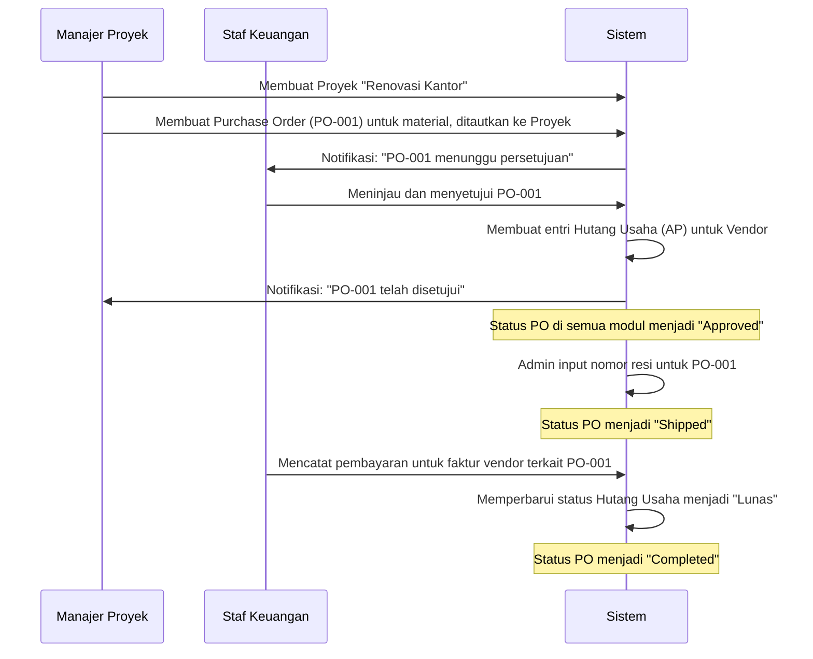

# Business Requirement Document (BRD)
**Proyek:** Sistem Manajemen Terintegrasi (All-in-One System)
**Versi:** 1.0
**Tanggal:** 24 Mei 2024

---

## 1. Pendahuluan

### 1.1. Latar Belakang Proyek
Perusahaan modern memerlukan sistem yang efisien untuk mengelola berbagai aspek operasional, mulai dari sumber daya manusia, keuangan, hingga manajemen proyek. Saat ini, banyak data yang tersebar di berbagai platform, menyebabkan inefisiensi, kesulitan dalam pelaporan, dan risiko keamanan data. Proyek ini bertujuan untuk mengembangkan sebuah platform terintegrasi (All-in-One System) yang menyatukan semua fungsi bisnis utama ke dalam satu sistem yang kohesif, aman, dan mudah digunakan.

### 1.2. Tujuan Bisnis
- **Sentralisasi Data:** Mengintegrasikan data HR, Keuangan, Proyek, dan Aset untuk menciptakan satu sumber kebenaran (single source of truth).
- **Peningkatan Efisiensi:** Mengotomatiskan proses manual seperti penggajian, rekap absensi, dan pembuatan laporan keuangan.
- **Peningkatan Pengalaman Karyawan:** Menyediakan portal self-service bagi karyawan untuk mengakses informasi pribadi, mengajukan cuti, dan melihat slip gaji.
- **Penguatan Keamanan:** Menerapkan lapisan keamanan modern untuk melindungi data sensitif perusahaan dan karyawan.
- **Skalabilitas:** Membangun sistem yang dapat mengakomodasi pertumbuhan bisnis dan penambahan entitas perusahaan baru (multi-company).

---

## 2. Ruang Lingkup Proyek

### 2.1. Dalam Ruang Lingkup (In-Scope)
Pengembangan modul-modul berikut:
1.  Sistem Multi-Company
2.  Manajemen HR (HRM)
3.  Keuangan & Akuntansi
4.  Purchase Order (PO) Management 
5.  Manajemen Proyek
6.  Manajemen Help Desk
7.  Manajemen Aset
8.  CMS & Frontend
9.  Manajemen Peran & Keamanan
10. Pelaporan & Analitik
11. Integrasi AI (OCR & Chatbot)
12. Integrasi Notifikasi WhatsApp
13. Fitur Pendukung (Log Aktivitas, Backup, Impor/Ekspor)

### 2.2. Di Luar Ruang Lingkup (Out-of-Scope)
-   Integrasi dengan sistem pihak ketiga yang tidak disebutkan dalam dokumen ini.
-   Modul CRM (Customer Relationship Management).
-   Modul manufaktur atau manajemen inventaris gudang tingkat lanjut.
-   Aplikasi mobile native (fokus pada web-responsive).

### 2.3. Strategi Migrasi Data Awal
- **Tujuan:** Memindahkan data historis yang krusial dari sistem lama (misal: spreadsheet, software akuntansi lama) ke sistem baru sebelum go-live.
- **Data yang Dimigrasi:**
  - **HR:** Data karyawan aktif (profil lengkap).
  - **Keuangan:** Saldo awal Chart of Accounts (COA), daftar hutang piutang yang belum lunas per tanggal cut-off.
  - **Aset:** Daftar aset tetap beserta nilai bukunya.
- **Proses:**
  1.  **Ekstraksi & Pembersihan:** Tim bisnis akan mengekstrak data dari sistem lama dan membersihkannya (menghapus duplikat, memperbaiki format).
  2.  **Pemetaan:** Tim bisnis dan tim teknis akan memetakan kolom dari data lama ke field di sistem baru.
  3.  **Uji Coba Impor:** Tim teknis akan melakukan uji coba impor data ke lingkungan staging/pengujian.
  4.  **Validasi:** Tim bisnis akan memvalidasi data di lingkungan staging untuk memastikan akurasi.
  5.  **Migrasi Final:** Setelah divalidasi, proses impor akan dijalankan di lingkungan produksi selama periode cut-off (misal: akhir pekan sebelum go-live).
- **Tanggung Jawab:** Tim bisnis bertanggung jawab atas penyediaan dan validasi data. Tim teknis bertanggung jawab atas proses impor teknis.

---

## 3. Spesifikasi Teknis (Technology Stack)
Pengembangan aplikasi akan dibangun di atas tumpukan teknologi berikut untuk memastikan kinerja, keamanan, dan skalabilitas yang optimal.

| Komponen              | Teknologi | Versi/Spesifikasi      | Catatan                                                                        |
| :-------------------- | :-------- | :--------------------- | :----------------------------------------------------------------------------- |
| **Backend Framework** | Laravel   | 11.x                   | Menggunakan arsitektur MVC yang modern dan fitur keamanan bawaan.              |
| **Web Server**        | Apache    | 2.4.x atau lebih baru  | Dikonfigurasi dengan modul yang diperlukan untuk Laravel (misal: `mod_rewrite`). |
| **Database**          | MySQL     | 8.0 atau lebih baru    | Mendukung fitur-fitur modern seperti window functions dan JSON data types.     |
| **Bahasa Pemrograman**  | PHP       | 8.2 atau lebih baru    | Memanfaatkan fitur-fitur terbaru PHP untuk performa dan keamanan.              |
| **Frontend Template** | Kustom    | -                      | Menggunakan Bootstrap 5.                                                       |
| **Backend Template**  | Qovex - Admin Dashboard Template  | -                      | Template backend (HTML/CSS/JS) menggunakan Qovex (Qovex.7z) di direcotoru utama   |

---

## 4. Pemangku Kepentingan (Stakeholders)

| Peran             | Deskripsi                                                                                      |
| :---------------- | :--------------------------------------------------------------------------------------------- |
| **Super Admin**   | Memiliki akses penuh ke semua perusahaan dan semua modul. Mengelola konfigurasi sistem global. |
| **Admin Perusahaan**| Mengelola semua data dan modul untuk satu perusahaan spesifik.                                 |
| **Manajer HR**    | Mengelola data karyawan, absensi, cuti, dan penggajian.                                        |
| **Staf Keuangan** | Mengelola jurnal, buku besar, faktur, laporan keuangan, dan memproses pembayaran PO.           |
| **Manajer Proyek**| Membuat dan mengelola proyek, tugas, dan tim.                                                  |
| **Staf Help Desk**| Menerima, mengelola, dan menyelesaikan tiket dukungan dari karyawan.                           |
| **Karyawan**      | Mengakses portal pribadi, melakukan absensi, mengajukan cuti/klaim, dan melihat data personal. |

---

## 5. Persyaratan Fungsional (Functional Requirements)

Berikut adalah rincian detail untuk setiap modul.

### Modul 1: Multi-Company System
- **FR-MC-001: Isolasi Data Perusahaan**
  - **Deskripsi:** Sistem harus secara otomatis memisahkan data (karyawan, keuangan, proyek, dll.) untuk setiap perusahaan yang terdaftar. Pengguna dari Perusahaan A tidak boleh dapat melihat atau mengakses data dari Perusahaan B, kecuali Super Admin.
  - **Aturan Bisnis:** Implementasi menggunakan Global Scopes pada level database untuk memastikan isolasi data yang ketat.
  - **Kriteria Penerimaan:** Saat Admin Perusahaan A login, ia hanya melihat dashboard, karyawan, dan laporan milik Perusahaan A.

- **FR-MC-002: Company Switcher**
  - **Deskripsi:** Super Admin harus memiliki fitur dropdown/menu di antarmuka untuk beralih antar perusahaan yang dikelolanya.
  - **Aturan Bisnis:** Saat beralih, seluruh konteks aplikasi (dashboard, data, laporan) harus langsung berubah sesuai dengan perusahaan yang dipilih.
  - **Kriteria Penerimaan:** Super Admin dapat memilih Perusahaan B dari switcher, dan halaman akan me-refresh untuk menampilkan data Perusahaan B.

### Modul 2: HR Management (HRM)
- **FR-HR-001: Manajemen Data Karyawan**
  - **Deskripsi:** Manajer HR dapat melakukan CRUD (Create, Read, Update, Delete) pada data karyawan. Formulir harus mencakup data pribadi (NIK, KK, NPWP), kontak, pendidikan (multiple), informasi bank, BPJS, divisi, dan atasan.
  - **Aturan Bisnis:** Alamat harus menggunakan sistem hirarki dependen (dropdown Provinsi memfilter Kabupaten/Kota, dst.).
  - **Kriteria Penerimaan:** HR dapat menambahkan karyawan baru dengan semua field yang disebutkan dan mengunggah dokumen pendukung (misal: KTP, Ijazah).

- **FR-HR-002: Portal Karyawan (Self-Service)**
  - **Deskripsi:** Karyawan dapat login ke portal pribadi untuk melihat dashboard, memperbarui profil (dengan alur persetujuan), melihat sisa saldo cuti, riwayat slip gaji, notifikasi penugasan proyek, dan mengunduh Kartu Tanda Anggota (KTA) digital.
  - **Aturan Bisnis:** Perubahan data krusial (misal: nomor rekening) harus melalui persetujuan Manajer HR.
  - **Kriteria Penerimaan:** Karyawan login dan langsung melihat sisa cuti tahunannya di dashboard. Karyawan dapat mengunduh slip gaji bulan lalu dalam format PDF.

- **FR-HR-003: Manajemen Absensi (5-Layer Security)**
  - **Deskripsi:** Karyawan melakukan absensi (check-in/check-out) melalui perangkat mereka. Sistem harus menangkap foto, koordinat GPS, IP address, User Agent, dan ID perangkat.
  - **Aturan Bisnis:**
    1.  Sistem harus menolak check-in jika GPS terdeteksi palsu (mock location).
    2.  Sistem harus memvalidasi jarak antara lokasi karyawan dan lokasi kantor yang diizinkan.
    3.  Absensi yang mencurigakan (misal: IP berubah drastis dalam waktu singkat) harus ditandai dan memerlukan verifikasi manual oleh admin.
  - **Kriteria Penerimaan:** Karyawan yang mencoba check-in dari luar radius 100m dari kantor akan mendapatkan notifikasi error "Anda berada di luar jangkauan". Admin dapat melihat foto dan lokasi check-in setiap karyawan di dashboard absensi.

- **FR-HR-004: Manajemen Cuti**
  - **Deskripsi:** Karyawan dapat mengajukan cuti melalui portal. Sistem secara otomatis mengurangi saldo cuti yang sesuai setelah pengajuan disetujui.
  - **Aturan Bisnis:** Alur persetujuan (Approval Workflow) dapat dikonfigurasi (misal: Karyawan -> Atasan -> HR). Saldo cuti diperbarui secara real-time di semua antarmuka (portal karyawan, dashboard HR).
  - **Kriteria Penerimaan:** Karyawan mengajukan cuti 2 hari. Setelah disetujui atasan, saldo cutinya di dashboard langsung berkurang 2 hari.

- **FR-HR-005: Manajemen Penggajian (Payroll)**
  - **Deskripsi:** HR dapat memproses gaji dan menghasilkan slip gaji dalam format PDF untuk semua karyawan.
  - **Aturan Bisnis:** Karyawan dapat mengakses dan mengunduh riwayat slip gaji mereka (minimal 6 bulan terakhir) melalui portal. Sistem mencatat siapa saja yang telah mengunduh slip gaji.
  - **Kriteria Penerimaan:** HR berhasil men-generate slip gaji untuk semua karyawan divisi A. Karyawan B dapat login dan mengunduh slip gajinya.

- **FR-HR-006: OCR untuk Data Karyawan**
  - **Deskripsi:** Saat Manajer HR mengunggah dokumen seperti KTP atau NPWP di formulir data karyawan, sistem akan menggunakan OCR (Google Gemini) untuk secara otomatis mengekstrak dan mengisi kolom yang relevan (misal: NIK, Nama, Alamat, Nomor NPWP).
  - **Aturan Bisnis:** Data yang diekstrak harus ditampilkan untuk verifikasi oleh pengguna sebelum disimpan.
  - **Kriteria Penerimaan:** HR mengunggah gambar KTP. Kolom NIK, Nama, dan Alamat pada formulir terisi otomatis, menunggu konfirmasi dari HR.

### Modul 3: Finance & Accounting
- **FR-FIN-001: Chart of Accounts (COA) & Jurnal Umum**
  - **Deskripsi:** Staf Keuangan dapat mengelola COA sesuai standar akuntansi Indonesia. Mereka juga dapat membuat entri jurnal umum dengan sistem double-entry (debit/kredit).
  - **Aturan Bisnis:** Total debit harus selalu sama dengan total kredit untuk setiap transaksi jurnal.
  - **Kriteria Penerimaan:** Staf Keuangan berhasil mencatat transaksi "Pembayaran Sewa Kantor" dengan mendebit "Beban Sewa" dan mengkredit "Kas".

- **FR-FIN-002: Pembuatan Faktur (Invoice)**
  - **Deskripsi:** Sistem dapat menghasilkan faktur penjualan dalam format PDF.
  - **Aturan Bisnis:** Faktur harus secara otomatis menyertakan header perusahaan (logo, alamat, NPWP) dan footer (informasi bank) yang diambil dari pengaturan perusahaan.
  - **Kriteria Penerimaan:** Saat membuat faktur untuk Klien X, PDF yang dihasilkan memiliki kop surat dan detail bank Perusahaan A.

- **FR-FIN-003: Laporan Keuangan Standar**
  - **Deskripsi:** Sistem dapat menghasilkan 5 laporan keuangan standar: Laba Rugi, Neraca, Arus Kas, Perubahan Modal, dan Buku Besar.
  - **Aturan Bisnis:** Laporan dapat difilter berdasarkan rentang tanggal dan dapat diekspor ke format Excel/PDF.
  - **Kriteria Penerimaan:** Staf Keuangan dapat men-generate Laporan Laba Rugi untuk kuartal pertama tahun ini.

- **FR-FIN-004: Sinkronisasi PO ke Hutang Usaha (Accounts Payable)**
  - **Deskripsi:** Saat sebuah Purchase Order (PO) disetujui, sistem harus secara otomatis membuat entri yang sesuai di modul Hutang Usaha (Accounts Payable).
  - **Aturan Bisnis:** Pembayaran yang dicatat terhadap hutang ini akan memperbarui status pembayaran pada PO terkait (misal: Unpaid, Partially Paid, Paid).
  - **Kriteria Penerimaan:** Setelah PO-001 disetujui, sebuah catatan hutang kepada Vendor Z muncul di daftar Accounts Payable.

- **FR-FIN-005: OCR untuk Klaim Biaya & Faktur**
  - **Deskripsi:** Saat pengguna mengunggah gambar kuitansi atau faktur pembelian untuk klaim biaya (expense claim), sistem akan menggunakan OCR (Google Gemini) untuk mengekstrak nama vendor, tanggal, dan total jumlah.
  - **Aturan Bisnis:** Pengguna harus memverifikasi data yang diekstrak sebelum mengirimkan klaim.
  - **Kriteria Penerimaan:** Karyawan mengunggah foto kuitansi makan siang. Kolom "Total Biaya" dan "Tanggal Transaksi" pada form klaim terisi otomatis.

### Modul 4: Purchase Order (PO) Management
- **FR-PO-001: Manajemen Purchase Order**
  - **Deskripsi:** Pengguna yang berwenang (misal: Manajer Proyek, Staf Keuangan) dapat membuat, melihat, mengubah, dan membatalkan PO.
  - **Aturan Bisnis:** Setiap PO harus memiliki nomor unik, detail vendor, daftar item (deskripsi, kuantitas, harga), dan dapat dikaitkan dengan proyek tertentu dari Modul Manajemen Proyek. Status PO meliputi: Draft, Submitted, Approved, In Progress, Shipped, Completed, Canceled.
  - **Kriteria Penerimaan:** Manajer Proyek berhasil membuat PO baru untuk pembelian material dan mengaitkannya dengan "Proyek Pembangunan Gedung".

- **FR-PO-002: Input Resi dan Pelacakan Pengiriman**
  - **Deskripsi:** Admin dapat memasukkan nomor resi pengiriman dan nama kurir untuk setiap PO yang telah dikirim oleh vendor.
  - **Aturan Bisnis:** Memasukkan nomor resi akan secara otomatis mengubah status PO menjadi "Shipped".
  - **Kriteria Penerimaan:** Admin memasukkan nomor resi "JP1234567890" untuk PO-001, dan statusnya langsung berubah menjadi "Shipped".

### Modul 5: Manajemen Proyek
- **FR-PRJ-001: Manajemen Proyek & Tugas**
  - **Deskripsi:** Manajer Proyek dapat membuat proyek, memilih/menambahkan anggota tim dari daftar karyawan, dan membuat tugas-tugas di dalamnya.
  - **Aturan Bisnis:** Setiap tugas dapat diberi status (To Do, In Progress, Done), penanggung jawab, dan tenggat waktu.
  - **Kriteria Penerimaan:** Manajer Proyek membuat proyek "Website Baru" dan menugaskan task "Desain Homepage" kepada Karyawan C.

- **FR-PRJ-002: Papan Kanban**
  - **Deskripsi:** Harus tersedia tampilan papan Kanban di mana tugas-tugas dapat digeser (drag-and-drop) antar kolom status (misal: To Do, In Progress, Done).
  - **Aturan Bisnis:** Perubahan status di papan Kanban harus secara otomatis memperbarui status tugas tersebut.
  - **Kriteria Penerimaan:** Pengguna dapat memindahkan kartu tugas dari kolom "In Progress" ke "Done".

- **FR-PRJ-003: Sinkronisasi Proyek dengan PO**
  - **Deskripsi:** Dalam halaman detail proyek, harus ada tab atau bagian khusus yang menampilkan daftar semua Purchase Order (PO) yang terkait dengan proyek tersebut beserta statusnya.
  - **Aturan Bisnis:** Data PO (Nomor PO, Status, Total Biaya) yang ditampilkan harus sinkron secara real-time dengan data dari Modul PO Management.
  - **Kriteria Penerimaan:** Manajer Proyek membuka "Proyek Pembangunan Gedung" dan dapat melihat PO-001 dengan status "Shipped" di dalam daftar biaya proyek.

- **FR-PRJ-004: Tampilan Kalender Proyek**
  - **Deskripsi:** Modul proyek harus memiliki tampilan kalender untuk memvisualisasikan timeline proyek, milestone, dan tenggat waktu tugas.
  - **Aturan Bisnis:** Data di kalender harus sinkron dengan data proyek dan tugas. Pengguna dapat memfilter kalender berdasarkan proyek atau anggota tim.
  - **Kriteria Penerimaan:** Manajer Proyek dapat melihat semua tenggat waktu tugas untuk bulan ini dalam format kalender.

- **FR-PRJ-005: Notifikasi Penugasan Proyek**
  - **Deskripsi:** Ketika seorang karyawan ditambahkan ke dalam tim proyek, sistem harus secara otomatis mengirimkan notifikasi ke dashboard portal karyawan tersebut.
  - **Aturan Bisnis:** Notifikasi berisi nama proyek dan tautan langsung ke halaman detail proyek.
  - **Kriteria Penerimaan:** Karyawan C menerima notifikasi "Anda telah ditambahkan ke Proyek Website Baru" di dashboard-nya setelah ditugaskan oleh Manajer Proyek.

### Modul 6: Manajemen Help Desk
- **FR-HD-001: Manajemen Tiket Dukungan**
  - **Deskripsi:** Karyawan dapat membuat tiket dukungan melalui portal. Staf Help Desk dapat melihat, menetapkan prioritas, menugaskan, dan memperbarui status tiket (Open, In Progress, Resolved, Closed).
  - **Aturan Bisnis:** Setiap tiket memiliki nomor unik dan riwayat percakapan antara karyawan dan staf help desk.
  - **Kriteria Penerimaan:** Karyawan berhasil membuat tiket "Tidak bisa login ke sistem X". Staf Help Desk menerima tiket tersebut di dashboard-nya.

- **FR-HD-002: Notifikasi Status Tiket via WhatsApp**
  - **Deskripsi:** Sistem harus mengirimkan notifikasi otomatis melalui WhatsApp kepada karyawan setiap kali ada pembaruan status pada tiket mereka (misal: saat tiket dibuat, direspons, atau diselesaikan).
  - **Aturan Bisnis:** Notifikasi berisi nomor tiket, status baru, dan tautan untuk melihat detail tiket.
  - **Kriteria Penerimaan:** Saat Staf Help Desk mengubah status tiket menjadi "Resolved", karyawan langsung menerima pesan WhatsApp "Tiket #T123 Anda telah diselesaikan."

- **FR-HD-003: Basis Pengetahuan (Knowledge Base)**
  - **Deskripsi:** Admin dapat membuat, mengedit, dan mempublikasikan artikel bantuan (FAQ, tutorial) yang dapat diakses oleh semua karyawan untuk menyelesaikan masalah secara mandiri.
  - **Aturan Bisnis:** Artikel dapat dikategorikan dan memiliki fitur pencarian.
  - **Kriteria Penerimaan:** Karyawan dapat mencari "cara reset password" dan menemukan artikel panduan yang relevan.

### Modul 7: CMS & Frontend
- **FR-CMS-001: Halaman Pelacakan Pesanan (Order Tracking)**
  - **Deskripsi:** Frontend website harus memiliki halaman publik di mana pelanggan atau pihak terkait dapat melacak status pesanan/PO dengan memasukkan nomor PO.
  - **Aturan Bisnis:** Halaman ini hanya akan menampilkan informasi status yang aman untuk publik (misal: Order Confirmed, In Progress, Shipped, Delivered) dan tidak menampilkan detail keuangan.
  - **Kriteria Penerimaan:** Pelanggan mengunjungi `domain.com/track-order`, memasukkan nomor PO-nya, dan melihat status "Shipped".

### Modul 10: Pelaporan & Analitik
- **FR-REP-001: Dashboard Eksekutif**
  - **Deskripsi:** Super Admin dan peran eksekutif lainnya akan memiliki akses ke dashboard terpusat yang menampilkan Key Performance Indicators (KPI) dari berbagai modul.
  - **Aturan Bisnis:** Widget pada dashboard harus mencakup: Total Pendapatan vs Biaya (Keuangan), Tingkat Turnover Karyawan (HR), Progres Proyek Kritis (Proyek), dan Jumlah Tiket Help Desk Terbuka (Help Desk). Data harus diperbarui secara real-time atau mendekati real-time.
  - **Kriteria Penerimaan:** Super Admin login dan dapat melihat ringkasan kesehatan bisnis perusahaan dalam satu layar tanpa perlu berpindah modul.

### Modul 8: Keamanan & Akses
- **FR-SEC-001: Proteksi Form dengan Cloudflare Turnstile**
  - **Deskripsi:** Semua form publik dan krusial (login, registrasi, upload file) harus dilindungi oleh Cloudflare Turnstile untuk mencegah spam dan bot.
  - **Kriteria Penerimaan:** Halaman login menampilkan widget Turnstile, dan proses login gagal jika verifikasi Turnstile tidak berhasil.

- **FR-SEC-002: Manajemen Peran & Hak Akses**
  - **Deskripsi:** Super Admin dapat melakukan CRUD pada peran (Role). Untuk setiap peran, Admin dapat menentukan hak akses secara granular untuk setiap modul dalam sistem dengan pilihan izin `Baca`, `Tulis (Buat/Ubah)`, dan `Hapus`.
  - **Aturan Bisnis:**
    1.  Sistem menyediakan matriks hak akses di mana Admin dapat mencentang izin `Baca`, `Tulis`, dan `Hapus` untuk setiap modul (misal: HR, Keuangan, Proyek) per peran.
    2.  Perubahan hak akses pada sebuah peran akan langsung berlaku untuk semua pengguna dengan peran tersebut saat sesi login berikutnya.
    3.  Admin dapat mengaktifkan atau menonaktifkan akun pengguna tanpa menghapusnya.
  - **Kriteria Penerimaan:**
    1.  Admin membuat peran baru "Auditor Keuangan".
    2.  Untuk peran "Auditor Keuangan", Admin memberikan izin `Baca` pada modul Keuangan, tetapi tidak memberikan izin `Tulis` atau `Hapus`.
    3.  Pengguna dengan peran "Auditor Keuangan" dapat melihat laporan keuangan tetapi tombol untuk membuat jurnal atau menghapus faktur disembunyikan atau dinonaktifkan.

- **FR-SEC-003: Log Aktivitas (Audit Trail)**
  - **Deskripsi:** Sistem harus mencatat semua aktivitas penting yang dilakukan pengguna (misal: siapa yang mengubah data karyawan, siapa yang menghapus faktur, siapa yang login).
  - **Aturan Bisnis:** Log harus dapat difilter berdasarkan pengguna, aktivitas, dan rentang tanggal, serta dapat diekspor.
  - **Kriteria Penerimaan:** Admin dapat melihat log bahwa "Manajer HR B telah mengubah data gaji Karyawan C pada tanggal X jam Y".

- **FR-SEC-004: URL Login Kustom**
  - **Deskripsi:** Super Admin dapat mengatur URL login yang unik (misal: `domain.com/portal-rahasia`) untuk menggantikan URL login standar (misal: `domain.com/login`) guna meningkatkan keamanan.
  - **Aturan Bisnis:**
    1.  Setelah URL kustom diatur, URL login standar akan dinonaktifkan dan mengembalikan halaman 404 (Not Found).
    2.  Pengaturan ini dapat diterapkan secara global atau per perusahaan.
  - **Kriteria Penerimaan:** Super Admin mengubah URL login menjadi `/masuk-kantor`. Pengguna yang mengakses `/login` akan melihat halaman error 404, sedangkan yang mengakses `/masuk-kantor` akan melihat halaman login yang benar.

### Modul 10: Integrasi AI (Google Gemini)
- **FR-AI-001: AI Agent Chatbot**
  - **Deskripsi:** Sistem akan menyediakan antarmuka chatbot yang didukung oleh Google Gemini, dapat diakses oleh semua pengguna yang login untuk membantu tugas dan menjawab pertanyaan terkait data dalam sistem.
  - **Aturan Bisnis (Keamanan & Ruang Lingkup):**
    1.  **Akses Berbasis Peran:** Chatbot hanya dapat mengakses dan menampilkan data yang diizinkan untuk peran pengguna yang sedang berinteraksi. Data dari perusahaan lain atau modul terlarang tidak akan dapat diakses.
    2.  **Mode Baca (Read-Only):** Chatbot tidak dapat melakukan tindakan yang mengubah data (Create, Update, Delete). Perintah seperti "hapus karyawan X" atau "setujui cuti ini" akan ditolak dengan respons yang informatif.
  - **Kriteria Penerimaan:**
    1.  Seorang Manajer HR bertanya, "Berapa jumlah karyawan aktif di divisi Marketing?" dan chatbot memberikan jawaban yang benar.
    2.  Seorang Karyawan bertanya, "Hapuskan data gajiku," dan chatbot merespons, "Maaf, saya tidak dapat melakukan tindakan tersebut. Fungsi saya hanya untuk memberikan informasi."

- **FR-AI-002: Implementasi OCR Terpusat**
  - **Deskripsi:** Fungsi OCR yang disebutkan di modul HR dan Keuangan akan diimplementasikan sebagai layanan terpusat menggunakan Google Gemini API.
  - **Aturan Bisnis:** Layanan ini harus dirancang agar mudah diperluas untuk digunakan di modul lain di masa depan (misal: pembacaan nomor seri aset dari gambar).
  - **Kriteria Penerimaan:** Tim pengembang berhasil membuat service/class OCR yang dapat dipanggil dari berbagai controller di dalam aplikasi.

### Modul 12: Integrasi Notifikasi WhatsApp
- **FR-WA-001: Pengiriman Notifikasi Sistem**
  - **Deskripsi:** Sistem harus terintegrasi dengan penyedia layanan API WhatsApp untuk mengirimkan notifikasi transaksional.
  - **Aturan Bisnis:** Notifikasi yang dikirim meliputi: slip gaji tersedia, status persetujuan cuti, status faktur (dibuat/lunas), dan pembaruan tiket help desk. Pengguna dapat mengaktifkan/menonaktifkan notifikasi ini di pengaturan profil mereka.
  - **Kriteria Penerimaan:** Setelah HR memproses payroll, karyawan menerima pesan WhatsApp: "Slip gaji Anda untuk bulan Mei 2024 sudah tersedia di portal."

### Modul 13: Fitur Pendukung
- **FR-SUP-001: Impor & Ekspor Karyawan**
  - **Deskripsi:** HR dapat mengunduh template Excel untuk data karyawan, mengisinya, dan mengimpornya secara massal ke dalam sistem. Sistem juga harus menyediakan fitur ekspor data karyawan ke Excel dan PDF.
  - **Aturan Bisnis:** Sistem harus melakukan validasi data saat impor dan memberikan laporan error yang jelas (misal: "Baris 5: Format NIK tidak valid").
  - **Kriteria Penerimaan:** HR berhasil mengimpor 50 karyawan baru menggunakan file Excel.

- **FR-SUP-002: Backup & Restore**
  - **Deskripsi:** Sistem harus memiliki fitur backup otomatis harian (database + file) dan backup manual.
  - **Aturan Bisnis:** Super Admin dapat mengunduh file backup dan memiliki akses ke fitur restore (pemulihan data).
  - **Kriteria Penerimaan:** Super Admin dapat men-trigger backup manual dan mengunduh file `backup-YYYY-MM-DD.zip` yang berisi dump SQL dan folder uploads.

---

## 6. Persyaratan Non-Fungsional (Non-Functional Requirements)

| Kategori      | Persyaratan                                                                                                                                              |
| :------------ | :------------------------------------------------------------------------------------------------------------------------------------------------------- |
| **Kinerja**   | Waktu muat halaman rata-rata tidak boleh lebih dari 3 detik. Proses berat (generate laporan, impor massal) harus berjalan di background (queue). Panggilan API eksternal (misal: Google Gemini) harus memiliki timeout yang wajar (misal: 15 detik) untuk mencegah UI hang. |
| **Keamanan**  | Semua kata sandi harus di-hash. Implementasi Rate Limiting pada endpoint API krusial. Menggunakan HTTPS di seluruh aplikasi.                                |
| **Skalabilitas**| Arsitektur aplikasi harus mampu menangani penambahan 10 perusahaan baru dan 1000 karyawan baru per tahun tanpa degradasi performa yang signifikan.          |
| **Usabilitas**  | Antarmuka harus responsif dan dapat diakses dengan baik di perangkat desktop maupun mobile (tablet, smartphone). Desain harus bersih, modern, dan intuitif. |
| **Ketersediaan**| Sistem harus memiliki uptime minimal 99.5%.                                                                                                              |

---

## 7. Alur Proses Bisnis Utama (Business Process Flow)

### 6.1. Alur Proses Pengadaan untuk Proyek
Diagram ini menggambarkan bagaimana modul Proyek, PO, dan Keuangan bekerja sama.

---

## 8. Glosarium

| Istilah | Definisi |
| :--- | :--- |
| **Global Scopes** | Sebuah fitur pada level framework/database (misal: di Laravel) yang secara otomatis menerapkan filter pada semua query untuk model tertentu, digunakan untuk isolasi data multi-company. |
| **Device Fingerprinting** | Teknik untuk mengidentifikasi perangkat pengguna secara unik berdasarkan kombinasi atribut browser dan hardware (misal: User Agent, resolusi layar, font), digunakan untuk keamanan absensi. |
| **Cloudflare Turnstile** | Layanan CAPTCHA modern dari Cloudflare yang tidak mengganggu pengguna, digunakan untuk melindungi form dari bot dan spam. |
| **Double-entry** | Prinsip dasar akuntansi di mana setiap transaksi dicatat dalam minimal dua akun, dengan total debit harus sama dengan total kredit. |
| **OCR (Optical Character Recognition)** | Teknologi untuk mengubah berbagai jenis dokumen, seperti gambar yang dipindai, menjadi data teks yang dapat diedit dan dicari. |
| **Read-Only** | Sebuah mode akses di mana pengguna atau sistem hanya dapat melihat atau membaca data, tetapi tidak dapat mengubah, menambah, atau menghapusnya. |
